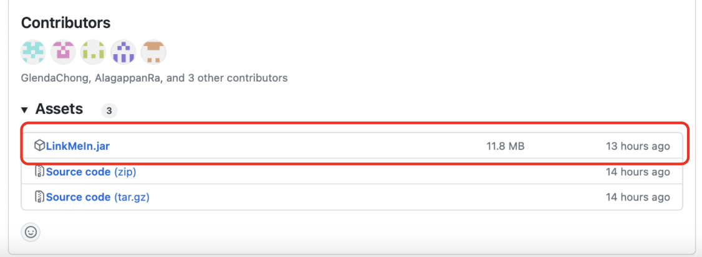
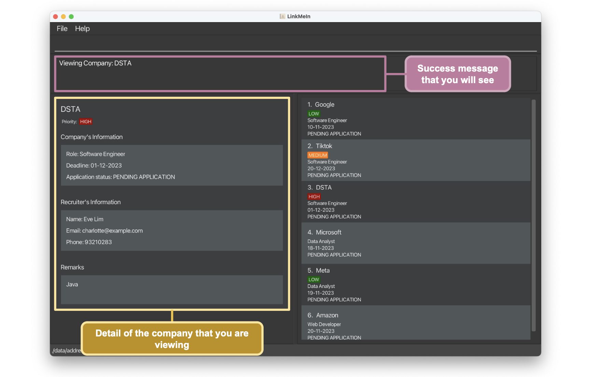
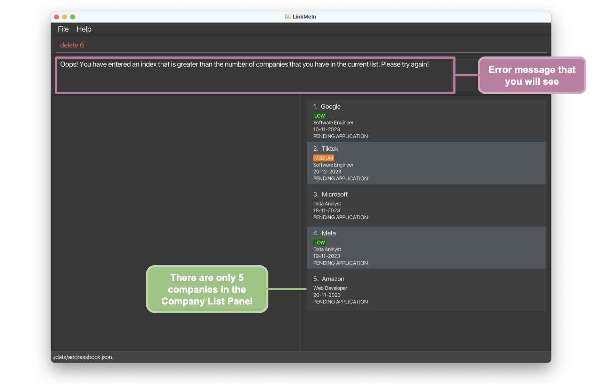
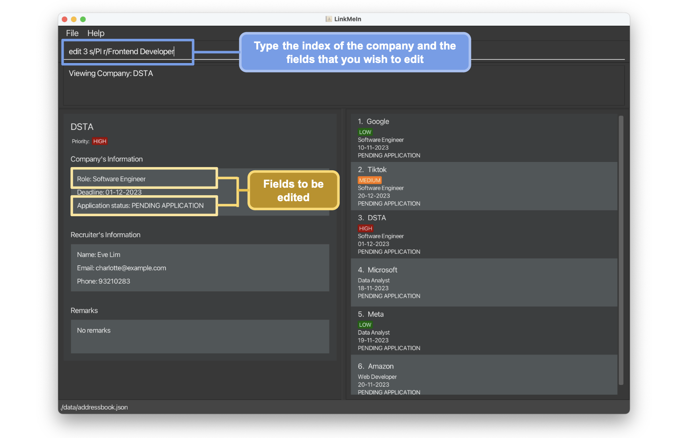
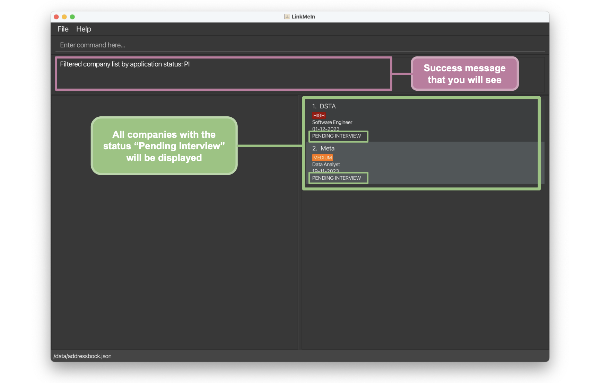
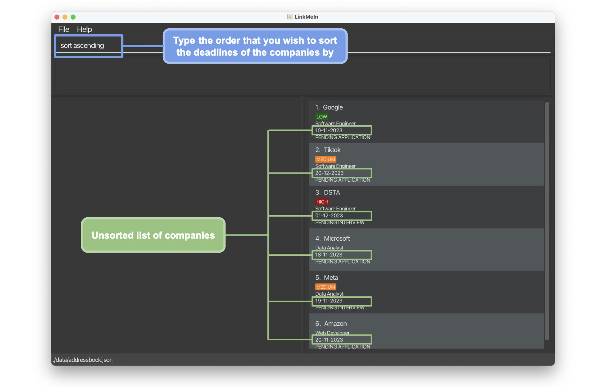
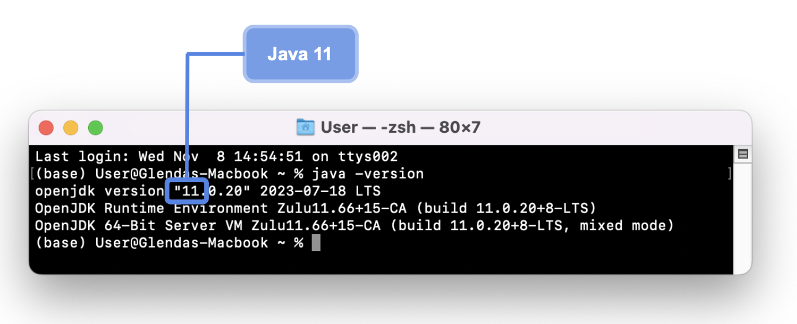

# Welcome to LinkMeIn!

_Master Your Internship Journey: Every Deadline, Every Detail._

LinkMeIn is a **desktop application** built for [NUS School Of Computing's (NUS) Computer Science students](https://www.comp.nus.edu.sg/programmes/ug/cs/) 
to track their internship applications.

Here is a **quick** overview of your internship journey with LinkMeIn:

-   Dynamic Data Management: Easily **add**, **edit**, and **filter** companies for targeted internship tracking.
-   Smart Organization: **Sort** applications by deadline and quickly pinpoint key opportunities.
-   Interactive Cards: Type **view** to expand internship details, a sleeker approach than Excel sheets.

LinkMeIn is more than just an application—it's your **personalized** partner, offering a
seamless experience that outclasses conventional tracking methods.

Additionally, LinkMeIn combines the rapid **efficiency** of Command Line Interface (CLI) with the visual clarity of 
[Graphical User Interface (GUI)](#introducing-linkmeins-gui), offering a **tailored** experience for internship management that outpaces the generic
spreadsheets of Excel.

## Introducing LinkMeIn's GUI
LinkMeIn's [GUI](#glossary) is designed to be **simple** and **intuitive** with you in mind. 
The GUI consists of four main components:

If you are unsure about what each component does, you can refer to the table below: 

| Number | Component            | Description                                              |
|--------|----------------------|----------------------------------------------------------|
| 1      | Command Box          | Key in your commands here and LinkMeIn will execute them |
| 2      | Message Box          | Displays success or error messages to you                |
| 3      | Company List Panel   | Displays the list of companies that you have added       |
| 4      | Company Detail Panel | Displays the detail of the company that you are viewing  |

**:information_source: Notes:** 
* To enhance your viewing experience, you can opt for full-screen mode in LinkMeIn! Nevertheless, even if you prefer not to use 
full screen, rest assured that most of LinkMeIn;s feature will still function flawlessly. 

# Navigating the User Guide

This user guide aims to empower you with the knowledge and skills needed to maximize the potential of LinkMeIn. We are
committed to guide you at every step of your internship journey. Whether you're a new user looking to get started or 
an experienced one seeking advanced insights, you'll find valuable information tailored to your unique 
needs and expertise.

Before we begin, let us first introduce you to the annotations that you will be seeing
throughout this user guide. 

**:bulb: Useful Tips:** 
* Provides you with additional insights or more efficient ways to use LinkMeIn.

**:information_source: Notes:** 
* Highlights supplementary information that you should be aware of, but isn't necessarily mission-critical.

**:exclamation: Warning:** 
* Alerts you of potential pitfalls or things to be cautious of when using LinkMeIn.

Throughout this guide, you will also notice **various text styles**. Here's what each of them means:
- _Represents possible scenarios that you can use a feature for (mainly in the feature sections)._
- [Represents hyperlinks that you can click into, which will direct you to another section of this user guide or to a website.]()
- `Represents content that you can type into the command box.`
- > Represents the acceptable parameters that you can key into a command.

Now that you are familiar with the annotations and text styles, let us teach you how to navigate this user guide according 
to your level of expertise. 

## New to LinkMeIn? ##

Thank you for choosing LinkMeIn as your internship tracking ally! We are excited to embark on this journey with you.

1. To get started, you can refer to the [Quick Start Section](#quick-start) to set up LinkMeIn.
2. After downloading LinkMeIn and setting up your computer, we have prepared a 
[Quick Tour](#introducing-linkmein-a-quick-tour) for you. This tour will help you get started with the key features of 
LinkMeIn that you will be using quite often.
3. If you choose to explore LinkMeIn on your own, you can refer to the [Features Section](#current-features) to find out
more about LinkMeIn's features.

## LinkMeIn Experts? ##
Welcome back! We hope that you have been enjoying your internship tracking journey with LinkMeIn.

1. If you need a refresher on how to use a feature, you can refer to the [Features Section](#current-features) to find
out more about LinkMeIn's features. In the features section, there are **detailed explanations** of each feature and
   **examples** to help you better understand how to use the feature.
2. To quickly refer to the command format of a feature, you can head over to the [Command Summary Section](#command-summary)
where all the commands are listed out in a table format.

If you face any issues while using LinkMeIn, you can refer to the [FAQ Section](#faq) to see if your issue has been addressed before.

# Table of Contents
* TOC
{:toc}

# Quick start
In this section, you will learn how to set up LinkMeIn in your computer. 

**Step 1: Verify Java Version:**

1. Make sure that you have **Java 11 or above** installed in your Computer. Click 
[here](#1-how-do-i-check-if-i-have-java-11-installed) if you are unsure of how to check if you have Java 11 installed.

**Step 2: Download LinkMeIn:**
1. With Java 11 installed, you can now download our latest jar file from [here](https://github.com/AY2324S1-CS2103T-T17-2/tp/releases/tag/v1.2.0)
2. Click on the `LinkMeIn.jar` file to download it.

**Step 3: Choose a home folder for LinkMeIn:**
1. Decide on a folder to use as the home folder for LinkMeIn. This folder will be used to store the data of LinkMeIn.
2. Create a new folder (you can name it "LinkMeIn") in a location of your choice, 
such as your Desktop or Documents folder
3. Move the downloaded jar file to the folder you have created in the previous step.

**Step 4: Launch LinkMeIn:**
1. Open up your terminal. If you are unsure of how to do so, you can check out [this FAQ](#2-how-do-i-open-up-my-terminal).
2. Navigate to the folder where you have placed the jar file with the `cd` command. 
   - For example if you have placed the jar file in the Documents folder, type `cd Documents` and press Enter.
3. Type `java -jar LinkMeIn.jar` and press Enter.

**:exclamation: Warning:** 
* Do not move or delete the `data` folder as it contains the data of your applications.

By now, you should have successfully launched LinkMeIn with the following window appearing on your screen.

If you are unsure about LinkMeIn's GUI, you can refer to the [GUI Section](#introducing-linkmeins-gui) to find out more.

Having successfully launched LinkMeIn, you are now ready to use LinkMeIn to track your internship applications. You 
can either refer to the [Quick Tour Section](#introducing-linkmein-a-quick-tour) to get started with LinkMeIn or you can
refer to the [Features Section](#current-features) to find out more about LinkMeIn's features.

[&uarr; Back to Table of Contents](#table-of-contents)

---

# Introducing LinkMeIn: A Quick Tour

_If you are new to LinkMeIn, welcome aboard! We know that navigating the world of internship applications can be
daunting, especially when you have multiple opportunities in sight. But fret not, because with LinkMeIn,
you have a reliable companion to guide you through this exciting journey._

This tour aims to help you get started with LinkMeIn by introducing you to its essential features that you will be
using quite often. In this tour, you will be learning how and when to:

-   [add a company](#1-adding-your-first-company),
-   [view its details](#2-viewing-company-details),
-   [edit its details](#3-editing-company-details),
-   [delete it](#4-deleting-a-company).

Before we embark on this tour remember to download LinkMeIn and have your computer set up correctly. If you have not
done so, do check out the [Quick Start Guide](#quick-start) for more information.
Now, follow us along this tour and transform yourself into a master of your internship application!

## 1. Adding your first company

Adding a company is the first step to tracking your internship applications. Let us start off by adding your
first company to LinkMeIn.

**Step 1:** Type the following `add c/Tesla r/Software Engineer s/PA n/John Tan d/10-10-2023 e/johntan@example.com
p/987654321 pr/high` in the command box and press **Enter**.

- If you wish to learn more about what each parameter means and how to use the add command, you can do so [here](#adding-a-company--add).

**Step 2:** You should see a new entry successfully added into LinkMeIn as shown below.

Congratulations! You have successfully added your first company to LinkMeIn. Go ahead and try adding a few more companies on your own!
Here are some more examples that you can try: 
- `add c/Oracle r/Data Analyst s/PA n/Marry Lim d/12-11-2023 e/marrylim@example.com p/98452321`
- `add c/Samsung r/Software Engineer s/PA n/Bob Cheng d/04-03-2023 e/bobcheng@example.com p/88283345 pr/low`

## 2. Viewing company details

Now that you had added your first few companies into LinkMeIn, you may want to view the details of a specific company.

**Step 1:** To view the details of DSTA, type `view 3` in the command box and press Enter.

**Step 2:** You should see the details of DSTA displayed in the company detail panel.

If you wish to read up more on the view
command, you can do so [here](#view-full-company-information-view). Go ahead and try viewing the details of a few
more companies on your own!

## 3. Editing company details

After viewing the details of a company, you may realise that you have a typo in the role of a company, and you wish to
edit the details of the company.

**Step 1:** To edit the application status and role of DSTA, type `edit 6 s/PI r/Frontend Developer` in the command box
and press Enter.

- If you wish to learn more about the edit command, you can do so [here](#edit-a-companys-information-edit).

**Step 2:** You should see the details of DSTA updated.

Go ahead and try editing the details of a few more companies on your own! 

## 4. Deleting a company

After adding a few companies, you can delete the companies that you no longer need to track in LinkMeIn.

**Step 1:** To delete DSTA, type `delete 3` in the command box and press Enter.

**Step 2:** You should see the details of DSTA removed from LinkMeIn.

Go ahead and try deleting the other companies too. If you wish to read up more on the delete command, you can do so
[here](#deleting-a-company--delete).

**Congratulations!** You have completed the quick tour of LinkMeIn. You are now ready to use LinkMeIn to track your own 
internship applications. To remove the sample data provided in LinkMeIn, simply type `clear` in the command box to remove 
all existing entries. Find out more about the `clear` command [here](#clear-all-entries-clear).

LinkMeIn offers more than just the features that you have learnt in this tour.
If you wish to learn more about the other features of LinkMeIn, you can do so
[here](#current-features). You can also visit the [FAQ](#faq) to view the frequently asked questions if you need more help!

[&uarr; Back to Table of Contents](#table-of-contents)

---

# Current Features

LinkMeIn's feature can be categorised into 3 broad categories:

-  [General Features](#general-features): This section equips you with essential tools to navigate LinkMeIn effectively.
Here, you can access help, clear all entries, and gracefully exit LinkMeIn.
- [Company Management Features](#company-management-features): Dive into section to **engage with individual company entries.** You can easily
add, view, edit, delete companies, as well as add your own remarks to companies. 
- [Company List Features](#company-list-features): This section allows you to **interact with the list of companies,** thereby unlocking LinkMeIn's full potential. 
Explore option to find, list, filter and sort companies, managing all companies with ease. 

**:information_source: Notes:** 
* Parameters can be in any order. e.g. if the command specifies n/COMPANY_NAME r/ROLE, r/ROLE c/COMPANY_NAME is also acceptable.
* Parameters are case-insensitive. e.g. c/COMPANY_NAME is the same as c/company_name.
* Parameters with enclosing [ ] braces refer to it being OPTIONAL.

## General Features

### Clear all entries: `clear`

Clears all entries of internship application.

**Format:** `clear`

**:exclamation: Warning:** 
* Entries cannot be recovered after clearing.

### Exit LinkMeIn: `exit`

Exits the program and closes the window.

**Format:** `exit`

**:information_source: Notes:** 
* Entries will be saved automatically.

### Help: `help`

Displays a window that allows you copy the url and subsequently view our user guide on a browser.

**Format:** `help`

[&uarr; Back to Table of Contents](#table-of-contents)

## Company Management Features

### Adding a company : `add`

_You scroll through your LinkedIn feed and see a company that you are interested in.
You wish to start on the application later, but you are afraid that you will forget about it.
Add the company to LinkMeIn now to keep track of the application process using the `add` command!_

**Format**:
`add c/COMPANY_NAME r/ROLE s/APPLICATION_STATUS d/DEADLINE n/RECRUITER_NAME e/EMAIL p/PHONE_NUMBER [pr/PRIORITY]`

> All [**parameters**](#parameters-description) specified in the format are compulsory except for PRIORITY.

**:information_source: Notes:** 
* Order of input **does not** matter.

**Example:**

**Step 1:** You came across the _Software Engineer_ role from _Apple_ which you are interested to apply for after touching up your resume. The deadline for this application is _10 October 2023_. The recruiter is _John Tan_, and you noted down his email address _johnd@example.com_ and his phone number _98765432_, so that you can contact him in the future. The priority of this application is _medium_ as you have other applications that you want to focus on first.

**Step 2:** With the details above, simply type `add c/Apple r/Software Engineer s/PA n/John Tan d/12-12-2023 e/johntan@example.com p/987654321 pr/medium` into the command box and press Enter.

**Step 3:** The detail panel will be updated to show the details of the newly added company's application, and the company will be added to the list of companies.

**Step 4:** You can proceed to add more companies by repeating the steps above!

**:bulb: Useful Tips:** 
* To quickly navigate to the start and end of your input, you can use 'Ctrl' (Windows User) / 'Command' (Mac User) with the 'Left' and 'Right' arrow keys respectively!

**Possible Error:**
If you miss out any of the compulsory parameters, you will see an error message in the command box informing you of the invalid command format.
Don't worry, just identify the missing parameter(s) and edit your input accordingly! An example of the error message is shown below.

[&uarr; Back to Table of Contents](#table-of-contents)

### View full company information: `view`

_You look at the list of companies and you see a company that has not been getting back to you. You can use the view
command to view the company's recruiter's contact details to follow up with them. The view command allows you to view
the detail of any company from the list of companies that you have added._

**Format:** `view INDEX`

> INDEX must be a positive integer number e.g 1,2,3... and must not be greater than the number of company in the list.

**:information_source: Notes:** 
* INDEX refers to the index number shown in the displayed company list.

**Example:**

**Step 1:** After scrolling through your list of companies, you wish to view the details of the company DSTA.
Simply type `view 3` to view DSTA's details.

**Step 2:** The detail panel will be updated to show the details of DSTA.

**Possible Error:**
If you enter an [**invalid index**](#5-what-is-an-invalid-index), you will see an error message in the command box.
Don’t worry, just edit your index accordingly and try the command again!
An example of an error message is shown below.

[&uarr; Back to Table of Contents](#table-of-contents)

### Deleting a company : `delete`

_Whether you accidentally added a company or no longer want to track it, don't worry! LinkMeIn got you covered!
You can use the delete command to delete the company from the list of companies that you have added._

**Format:`delete INDEX`**

> INDEX must be a positive integer number e.g 1,2,3... and must not be greater than the number of company in the list.

**:information_source: Notes:** 
* INDEX refers to the index number shown in the displayed company list. You can only delete one company at a time. 

**Example:**

**Step 1:** Let's say after viewing the company DSTA, you decide that you no longer want to track it.
Simply type `delete 3` to delete DSTA.

**Step 2:** DSTA will be removed from the list of companies. The detail panel will be cleared too.

**Possible Error:**

If you enter an [**invalid index**](#5-what-is-an-invalid-index),
you will see an error message in the command box. Don’t worry, just edit your index accordingly and
try the command again!
An example of an error message is shown below.

[&uarr; Back to Table of Contents](#table-of-contents)

### Add remark to a company: `remark`

_After adding a company, if you wish to note down more information such as job description,
use the `remark` command to input these additional details._

**Format:** `remark INDEX re/REMARK`

> `INDEX`: Adds remark of the company at INDEX number shown in the displayed company list.  
> `re/REMARK` : type prefix `re/` followed by the remark you want to add 

**:information_source: Notes:** 
* Remark cannot be empty. Use the unremark command to delete instead.

**:exclamation: Warning:** 
* When adding a remark, the existing remark of the company will be removed i.e adding of remark is not cumulative.

**Examples:** 

**Step 1.** After adding the internship for Microsoft into LinkMeIn,
   you also want to note down that this internship requires experience in Java.

**Step 2.** To note this down, type `remark 1 re/need Java`
   

**Step 3.** You can view the remark the 1st company as shown below.
   

**Step 4.** Go ahead and add remarks for more companies on your own!

   **More examples:**
    - remark 3 re/interview went well!
    - remark 4 re/$800 per month

**Possible Error:**

If you enter an **empty remark**,
you will see an error message in the command box. Don’t worry, just add in your remark and
try the command again!
An example of an error message is shown below.

### Delete the remark of a company: `unremark`

_If you input some remarks to the wrong company or the remark has become outdated,
use the `unremark` command to delete it._

**Format:** `unremark INDEX`

> `INDEX`: Deletes remark of the company at INDEX number shown in the displayed company list.

**:bulb: Useful Tips:** 
* To update the remark, you do NOT need to delete using unremark first.
Directly use the remark command and it overwrites the old remark!

**Examples:**

**Step 1.** If you wish to delete the remark of Google, type `unremark 4`
   

**Step 2.** You can view the remark the 1st company as shown below.
   

**Possible Error:**

If you enter an [**invalid index**](#7-what-is-an-invalid-index),
you will see an error message in the command box. Don’t worry, just edit your index accordingly and
try the command again!
An example of an error message is shown below.

### Edit a company's information: `edit`

_If you made a typo or need to update the progress of application,
use the `edit` command to input the accurate details._

**Format:** `edit INDEX [c/COMPANY_NAME] [n/RECRUITER_NAME] [r/ROLE] [s/APPLICATION_STATUS] [d/DEADLINE] [e/EMAIL] [p/PHONE_NUMBER] [pr/PRIORITY]`

>`INDEX`: Edits the company at INDEX number shown in the displayed company list.
>
>`c/COMPANY_NAME` etc. : type prefix `c/` followed by new company name to edit company name. 
>
> At least one of the optional fields must be provided.

**Examples:** 

1. You received an email from Microsoft to interview for a Frontend Developer role instead, which is different from the Software Engineer role you applied for.
To edit the company's information, type `edit 2 s/PI r/Frontend Developer`

2. The status and role of the 2nd company in the list is edited to be Pending Interview and Frontend Developer respectively.

3. Go ahead and edit more companies on your own! 

    **More examples:**
    - edit 3 d/11-09-2025 pr/LOW
    - edit 1 n/Amy Tan e/amytan@gmail.com

**Possible Error:**

If you enter an **invalid prefix**,
you will see an error message in the command box. Don’t worry, just edit your prefixes accordingly and
try the command again!
An example of an error message is shown below.

[&uarr; Back to Table of Contents](#table-of-contents)

## Company List Features

### Find a company: `find`

_You've applied to many companies and now you want to track a specific internship application for a particular
company. Use the `find` command to quickly locate the company you want._

**Format:** `find KEYWORD [MORE_KEYWORDS]...`

-   **Case-Insensitive Search:** Whether you type `tiktok` or `TikTok`, it will still match `TikTok`.
-   **Order Independent:** You can search for `tiktok google` and it will find `Google TikTok`.
-   **Substring Matching:** Typing `tik` will return companies like `TikTok`.

> **Note:** The `find` command searches only the company name.

**Search Criteria:**

-   Companies with names that contain **any** of the keywords will be returned. You can enter multiple keywords.

**Example:**

**Step 1:** Let's say you want to follow up on a DSTA application. Simply type `find ds` to search for DSTA.

**Step 2:** You will see the list of companies that match your search criteria. In this case, the company DSTA will be
shown. And that is it! You have found the company you wanted.

[&uarr; Back to Table of Contents](#table-of-contents)

### Listing all contacts : `list`

_You've found the specific company you wanted using the find command earlier, and now you want to see all of your applications in one list again. You can do so easily with the `list` command!_

**Format:** `list`

**Example:**

**Step 1:** You have used the `find` command to find the company _DSTA_ earlier. Now, you want to see all of your applications in one list again. Simply type `list` to view the full list of your applications again!

**:information_source: Notes:** 
* Whenever LinkMeIn is started, you will see the full list of companies displayed by default (i.e. `list` command is executed automatically).

[&uarr; Back to Table of Contents](#table-of-contents)

### Filter companies by application status: `filter`

_Can't remember which applications you haven't submitted or want to prepare for the companies that have offered you an interview?
Filter the list of companies by their application status using the `filter` command!_

**Format:** `filter s/APPLICATION_STATUS`

> [**APPLICATION_STATUS**](#application-status-description) should be one of the following: `PA`, `PI`, `PO`, `A`, `R`.

**Example:**

**Step 1:** You want to prepare for the upcoming interviews you have received. 

**Step 2:** Simply type `filter s/PI` to filter the list of companies to show only companies with status "Pending Interview" and press Enter.

**Step 3:** You can then view all the companies that you have pending interviews for from the company list.

**Possible Error:**

If you enter an invalid prefix for the filter command, you will see an error message informing you of the invalid command, and suggest the correct format to follow.

[&uarr; Back to Table of Contents](#table-of-contents)

### Sort companies by their deadlines: `sort`

_Want to see which application deadlines are coming up soon or which ones are far off? Use the `sort` command to
arrange your list of applications based on their deadlines._

**Format:** `sort SORT_ORDER`

Where `SORT_ORDER` can be:

-   `ascending` or its short forms `a` or `asc`: to sort nearest deadlines first.

-   `descending` or its short forms `d` or `desc`: to sort furthest deadlines first.

-   The sort is case-insensitive. e.g. `ASCENDING` and `ascending` are treated the same.

**:information_source: Notes:** 
* If no order is specified, sort will default to `ascending`.

**Example:**

**Step 1.** You've lost track of time and are uncertain about which internship deadlines are looming. Your current
list looks chaotic. Just type `sort ascending` to sort the list of applications by their deadlines.

**Step 2.** Your applications are now organized by upcoming deadlines. Time to start applying without delay!

**Possible Error**

Suppose you misspelled the `SORT-ORDER` keyword, you will see an error message informing you of the invalid command,
and suggest the correct keyword to use:

[&uarr; Back to Table of Contents](#table-of-contents)

---

## Glossary

### Definitions of Key Terms

Encountered an unfamiliar term when using LinkMeIn? Read the respective descriptions to better understand the term!

| Term          | Definition                                                                                                                                                                                                                          |
| ------------- | ----------------------------------------------------------------------------------------------------------------------------------------------------------------------------------------------------------------------------------- |
| **CLI**       | Command-Line Interface (CLI) is a text-based user interface where users interact with the application by typing commands.                                                                                                           |
| **GUI**       | Graphical User Interface (GUI) is a visual method to interact with software using icons, buttons, and windows. GUI provides a user-friendly way to interact with software using graphical elements rather than text-based commands. |
| **Command**   | A command is an instruction given by a user to LinkMeIn to perform a specific action. For example,`add` command is a command to add the company's application into LinkMeIn.                                                        |
| **Parameter** | Parameter is similar to a field in a form you have to fill up. For example, in the command `edit 1 c/COMPANY_NAME e/EMAIL`, `c/COMPANY_NAME` and `e/EMAIL` are parameters in the command.                                           |
| **Prefix**    | Prefix is a keyword that is used to identify the parameter. For example, in the command `edit 1 c/COMPANY_NAME e/EMAIL`, `c/` and `e/` are prefixes.                                                                                |

### Parameters Description

| Parameter            | Description                                   | Constraints                                                                                                                                                                            |
|----------------------|-----------------------------------------------|----------------------------------------------------------------------------------------------------------------------------------------------------------------------------------------|
| c/Company Name       | Name of the company that you are applying to. | Only contain alphanumeric characters and spaces, and should not be blank. Maximum of 100 characters (excluding spaces).                                                                |
| r/Role               | Role of the internship that you are applying. | Only contain alphanumeric characters and spaces, and should not be blank. Maximum of 100 characters (excluding spaces).                                                                |
| s/Application Status | Status of the application.                    | Case-insensitive and should be one of the following: `PA`, `PI`, `PO`, `A`, `R`. Refer to [Application Status Description](#application-status-description) for other possible inputs. |
| d/Deadline           | Deadline of the application.                  | Should be in DD-MM-YYYY format.                                                                                                                                                        |
| n/Recruiter Name     | Name of the recruiter.                        | Only contain alphanumeric characters and spaces, and should not be blank. Maximum of 100 characters (excluding spaces).                                                                |
| e/Email              | Email of the recruiter.                       | Should be in the format of `local-part@domain` and should not be blank.                                                                                                                |
| p/Phone Number       | Phone number of the recruiter.                | Only contain numbers, be at least 3 digits and at most 20 digits long. Should not be blank.                                                                                            |
| pr/Priority          | Priority of the application.                  | Case-insensitive and should be one of the following: `high`, `medium`, `low`, `none`.                                                                                                  |
| re/Remark            | Remark of the application.                    | Should not be blank.                                                                                                                                                                   |

**:information_source: Notes:** 
* If you enter an invalid input for any of the prefixes, you will see an error message in the command box. Check the description for the respective prefix and try the command again! An example of an error message is shown below.

### Application Status Description

| Application Status  | Other Accepted Inputs                                        | Description                                                                                                                                         |
|---------------------|--------------------------------------------------------------|-----------------------------------------------------------------------------------------------------------------------------------------------------|
| PENDING APPLICATION | PA, PENDAPP, PENDINGAPP, PENDINGAPPLICATION, P A, PENDING A  | This means that you have not submitted the application, but are currently working on it.                                                            |
| PENDING INTERVIEW   | PI, PENDINT, PENDINGINT, PENDINGINTERVIEW, P I, PENDING I    | This means that you have submitted the application, and are either waiting for an interview offer, or waiting to go for the interview.              |
| PENDING OUTCOME     | PO, PENDOUT, PENDINGOUT, PENDINGOUTCOME, P O, PENDING O      | This means that you have went through the interview, but the final decision or outcome (whether accepted or rejected) hasn't been communicated yet. |
| ACCEPTED            | A, ACC, ACPT, ACCEPT, ACCEPTED                               | This means you have been offered the internship position. Congratulations!                                                                          |
| REJECTED            | R, REJ, REJECT, REJECTED                                     | Unfortunately, this means that the application wasn't successful and you were not offered the internship. Don't worry, try again next time!         |

[&uarr; Back to Table of Contents](#table-of-contents)

---

## FAQ

### 1. How do I check if I have Java 11 installed?

* Open up your terminal. If you are unsure of how to do so, you can refer to [here](#2-how-do-i-open-up-my-terminal-).
* Type `java -version`. If you have Java installed, you will see the following:

* If you do not have Java installed, you can download it [here](https://www.oracle.com/sg/java/technologies/downloads/#java11).
Remember to download the Java 11 version. 
* You can refer to the guides below to install Java 11:
  * Windows: [Guide](https://www.java.com/en/download/help/windows_manual_download.html) to install Java.
  * Mac: [Guide](https://www.java.com/en/download/help/mac_install.html) to install Java.
  * Linux: [Guide](https://www.java.com/en/download/help/linux_x64_install.html) to install Java.

### 2. How do I open up my terminal?
* **Windows:** Click the Windows Start button, and type "Command Prompt" or "cmd" into the search bar. 
  Press Enter to open it.
* **macOS:** Press Command (⌘) + Spacebar to open Spotlight Search. Type "Terminal" and press Enter when it appears in the 
  search results.

### 3. How do I load data from another computer?

Delete the `addressbook.json` file (stored at `[JAR file location]/data/addressbook.json`) from the computer that you wish to use LinkMeIn on. Then, copy over the `addressbook.json` file from the computer which you no longer wish to use LinkMeIn on. After which, boot up LinkMeIn to check whether your doctor information is properly loaded into the new computer.

### 4. Why am I unable to run LinkMeIn?

Make sure you have Java 11 installed on your machine as the product only runs on Java 11.

### 5. What is an invalid index?

An invalid index is a non-positive integer or an index greater than the number of companies you have.
e.g -1, 0, a, \*, 1 0 (Only one index is allowed at a time). Positive index should not exceed the maximum allowed range
of 2147483647.

[&uarr; Back to Table of Contents](#table-of-contents)

---

## Known issues

To be updated.

[&uarr; Back to Table of Contents](#table-of-contents)

---

## Command Summary

| Command  | Format                                                                                                                                             | Example                                                                                       |
|----------|----------------------------------------------------------------------------------------------------------------------------------------------------|-----------------------------------------------------------------------------------------------|
| `add`    | `add c/COMPANY_NAME r/ROLE s/APPLICATION_STATUS d/DEADLINE n/RECRUITER_NAME e/EMAIL p/PHONE_NUMBER [pr/PRIORITY]`                                  | `add c/Apple r/Software Engineer s/PA d/12-12-2023 n/John Tan e/johntan@gmail.com p/98765432` |
| `view`   | `view INDEX`                                                                                                                                       | `view 1`                                                                                      |
| `delete` | `delete INDEX`                                                                                                                                     | `delete 1`                                                                                    |
| `remark` | `remark INDEX re/REMARK`                                                                                                                           | `remark 1 re/need Java`                                                                       |
| `list`   | `list`                                                                                                                                             | `list`                                                                                        |
| `filter` | `filter s/APPLICATION_STATUS`                                                                                                                      | `filter s/PI`                                                                                 |
| `sort`   | `sort SORT_ORDER`                                                                                                                                  | `sort ascending`                                                                              |
| `edit`   | `edit INDEX [c/COMPANY_NAME] [n/RECRUITER_NAME] [r/ROLE] [s/APPLICATION_STATUS] [d/DEADLINE] [e/EMAIL] [p/PHONE_NUMBER] [pr/PRIORITY] [re/REMARK]` | `edit 1 s/PI r/Frontend Developer`                                                            |
| `find`   | `find KEYWORD [MORE_KEYWORDS]...`                                                                                                                  | `find ds`                                                                                     |
| `clear`  | `clear`                                                                                                                                            | `clear`                                                                                       |
| `exit`   | `exit`                                                                                                                                             | `exit`                                                                                        |
| `help`   | `help`                                                                                                                                             | `help`                                                                                        |

[&uarr; Back to Table of Contents](#table-of-contents)
