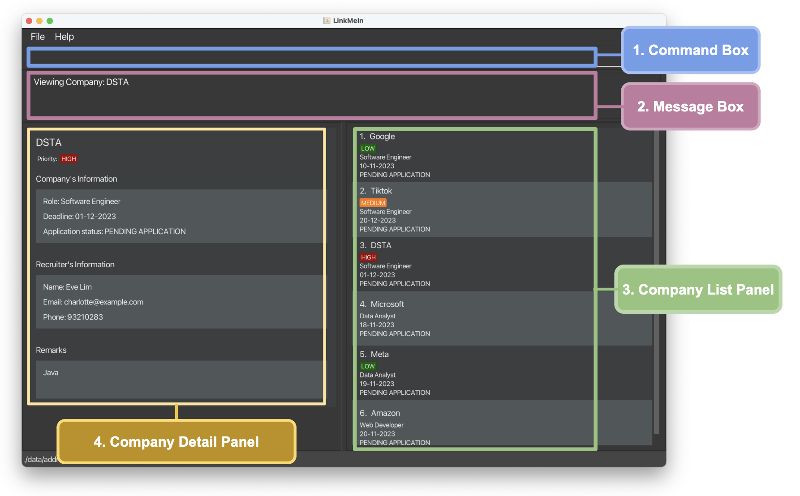
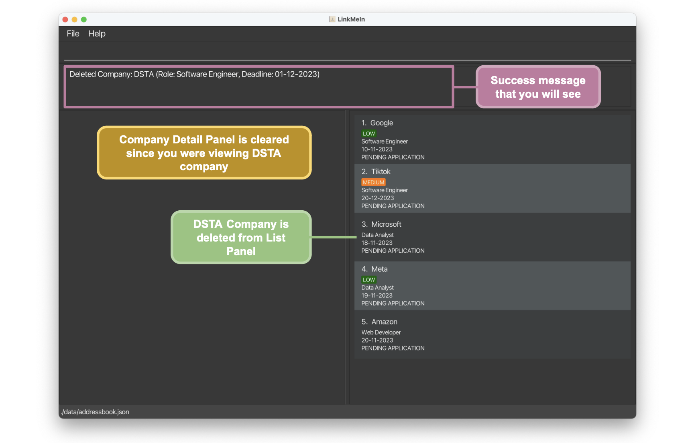
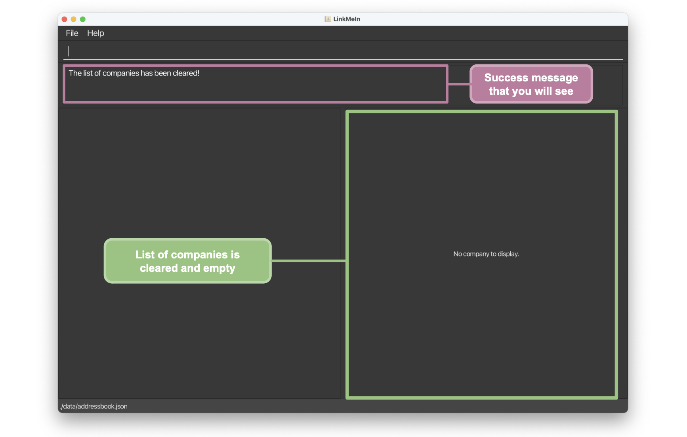
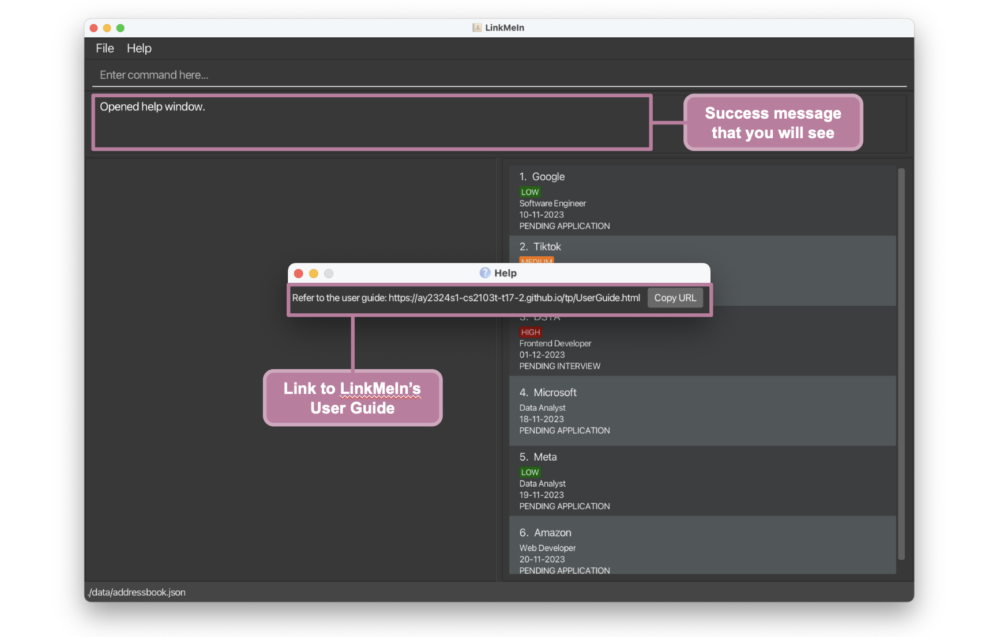
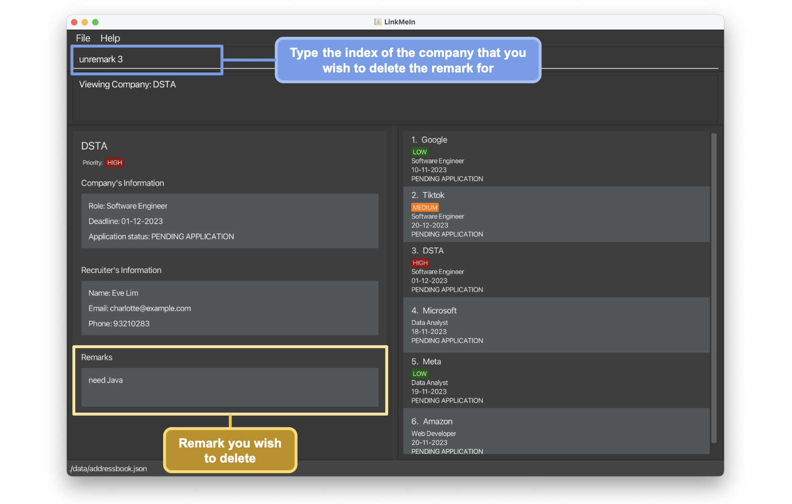
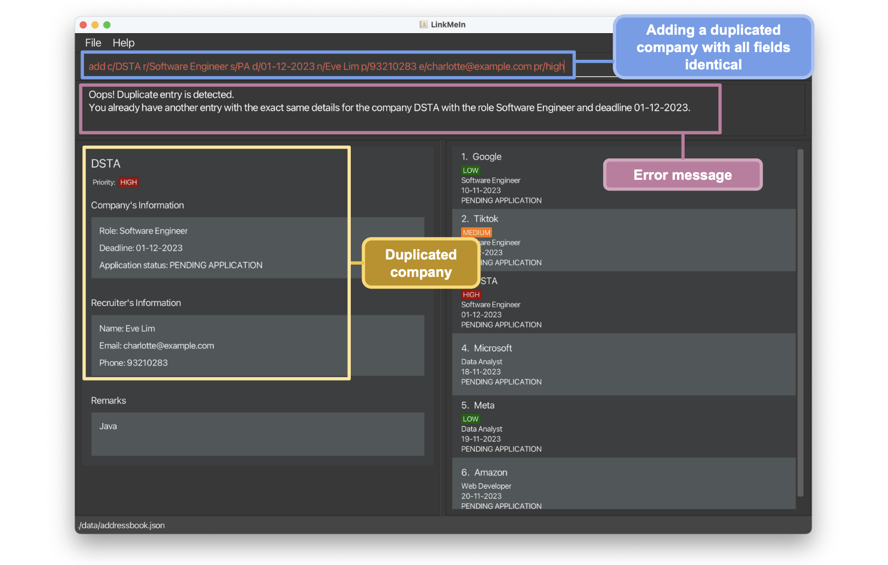
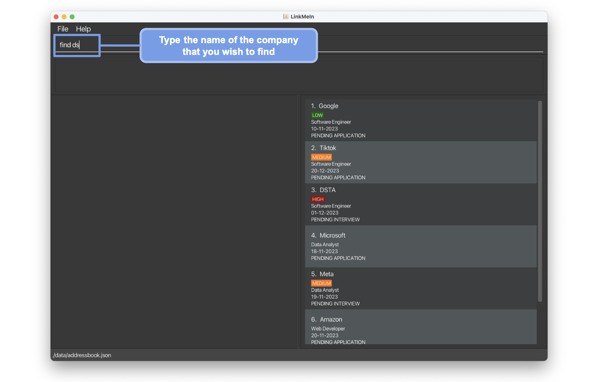
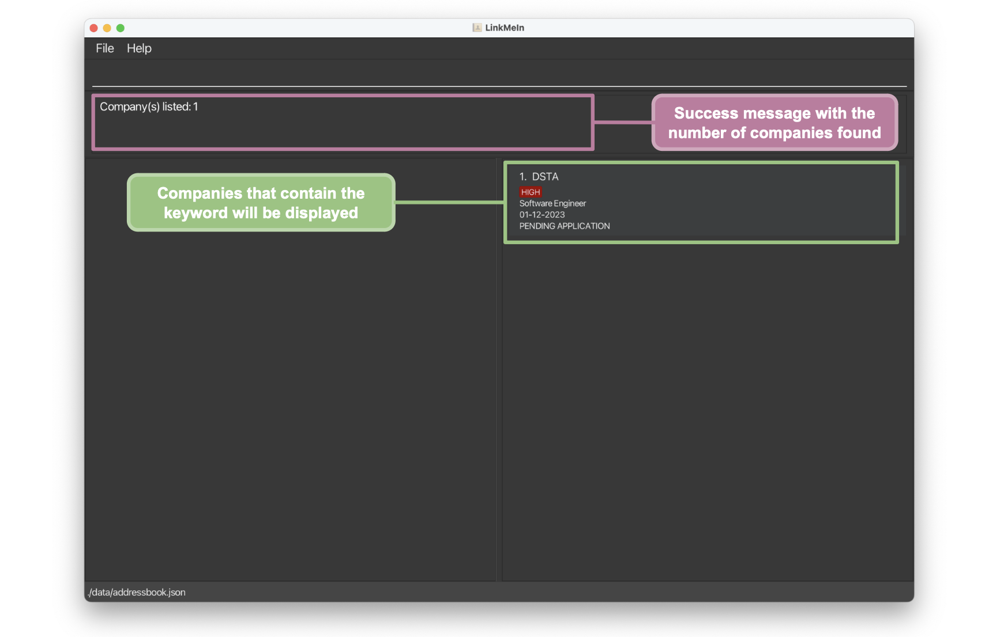

# Welcome to LinkMeIn!

_Master Your Internship Journey: Every Deadline, Every Detail._

It's that time of the year again! You're scrolling through LinkedIn to discover internship opportunities and tackling programming problems non-stop to prepare for your coding interviews, all in pursuit of securing a summer internship. To increase your chances, you've mass-applied to multiple companies, and now you're struggling to keep track of all your applications.

Well, fret not! LinkMeIn is here to help you! LinkMeIn is a **desktop application** specifically designed for all of you, NUS School Of Computing's Computer Science students, to effectively manage and track your internship applications.

Here is a **quick** overview of your internship journey with LinkMeIn:

-   Dynamic Data Management: Easily **add**, **edit**, **find** and **filter** companies for targeted application tracking.
-   Smart Organization: **Sort** applications by deadline and quickly pinpoint key opportunities.
-   Interactive Cards: Easily **view** details of a specific company — a sleeker approach than Excel sheets.

LinkMeIn is more than just an application — it's your **personalized** partner, offering a seamless experience that outclasses conventional tracking methods.

Moreover, LinkMeIn combines the rapid **efficiency** of [Command Line Interface (CLI)](#introducing-linkmeins-cli) with the visual clarity of [Graphical User Interface (GUI)](#introducing-linkmeins-gui), providing a **tailored** experience just for you.

# Table of Contents
* TOC
{:toc}

# Navigating the User Guide

This user guide aims to empower you with the knowledge and skills needed to maximize the potential of LinkMeIn. We are
committed to guide you at every step of your internship journey. Whether you're a new user looking to get started or 
an experienced one seeking advanced insights, you'll find valuable information tailored to your unique 
needs and expertise.

Before we begin, let us first introduce you to the annotations that you will encounter throughout this user guide. 

**:bulb: Useful Tip:** 
* Provides you with additional insights or more efficient ways to enhance your user experience with LinkMeIn.

**:information_source: Note:** 
* Presents additional details to you that are valuable to know when using LinkMeIn.

**:exclamation: Warning:** 
* Alerts you of potential pitfalls or things to be cautious of when using LinkMeIn.

Throughout this guide, you will also notice **various text styles**. Here's what each of them means:
- _Represents possible scenarios that you can use a feature for (mainly in the feature sections)._
- [Represents hyperlinks that you can click into, which will direct you to another section of this user guide or to 
  a website.](#)
- `Represents content that you can type into the command box.`
- > Represents the acceptable parameters that you can key into a command.

Now that you are familiar with the annotations and text styles, let us teach you how to navigate this user guide according 
to your level of expertise. 

## New to LinkMeIn? ##

Thank you for choosing LinkMeIn as your internship tracking ally! We are excited to embark on this journey with you.

1. To get started, you can refer to the [Quick Start Section](#quick-start) to set up LinkMeIn.
2. After downloading LinkMeIn and setting up your computer, we have prepared a 
[Quick Tour](#introducing-linkmein-a-quick-tour) for you. This tour will help you get started with the key features of 
LinkMeIn that you will be using quite often.
3. If you choose to explore LinkMeIn on your own, you can refer to the [Features Section](#current-features) to find out
more about LinkMeIn's features.

## LinkMeIn Experts? ##
Welcome back! We hope that you have been enjoying your internship tracking journey with LinkMeIn.

1. If you need a refresher on how to use a feature, you can refer to the [Features Section](#current-features) to find
out more about LinkMeIn's features. In the Features Section, there are **detailed explanations** of each feature and
   **examples** to help you better understand how to use them.
2. To quickly refer to the command format of a feature, you can head over to the [Command Summary Section](#command-summary)
where all the commands are listed out in a table format.

If you face any issues while using LinkMeIn, you can refer to the [FAQ Section](#faq) to see if your issue has been addressed before.

[&uarr; Back to Table of Contents](#table-of-contents)

# Quick Start
In this section, you will learn how to set up LinkMeIn in your computer. 

1. Make sure that you have **Java 11 or above** installed in your Computer. Click 
[here](#1-how-do-i-check-if-i-have-java-11-installed) if you are unsure of how to check if you have Java 11 installed.

2. With Java 11 installed, you can now download our latest jar file from [here](https://github.com/AY2324S1-CS2103T-T17-2/tp/releases/tag/v1.2.0).

3. Click on the `LinkMeIn.jar` file to download it.
    

        
    

4. Move the downloaded jar file into a home folder of your choice, such as the **Desktop** or **Documents** folder for your LinkMeIn.

5. Open up your command terminal. If you are unsure of how to do so, you can check out [this FAQ](#2-how-do-i-open-up-my-terminal).

6. Navigate to the folder where you have placed the jar file by typing `cd`, followed by the folder path.
   - For example if you have placed the jar file in the **Documents** folder, type `cd ~/Documents` and press `Enter`.
   
7. Enter the next command `java -jar LinkMeIn.jar` and press `Enter`. Your command terminal should look like this after Steps 6 and 7:
    

        
    

    

    **:exclamation: Warning:** 
    * Do not move or delete the `data` folder as it contains the data of your applications.
    

8. You should have successfully launched LinkMeIn with the following interface appearing on your screen.
    

        
    

9. Great job! You are now ready to learn about the [GUI](#introducing-linkmeins-gui) of LinkMeIn!

[&uarr; Back to Table of Contents](#table-of-contents)

# Introducing LinkMeIn's GUI
LinkMeIn's [GUI](#glossary) is designed to be **simple** and **intuitive**, with you in mind.
The GUI consists of four main components:

| Number | Component            | Description                                              |
|--------|----------------------|----------------------------------------------------------|
| 1      | Command Box          | Key in your commands here and LinkMeIn will execute them |
| 2      | Message Box          | Displays success or error messages to you                |
| 3      | Company List Panel   | Displays the list of companies that you have added       |
| 4      | Company Detail Panel | Displays the details of a company that you are viewing   |

**:bulb: Useful Tip:** 
* To maximise your viewing experience, opt for full-screen mode in LinkMeIn!

Now that you've been introduced to LinkMeIn's GUI, let's proceed to learn how you can use the CLI to interact with LinkMeIn. 

[&uarr; Back to Table of Contents](#table-of-contents)

# Introducing LinkMeIn's CLI

LinkMeIn operates through the Command Line Interface (CLI), where you interact with our app by simply **typing commands**. Say goodbye to the days of multitasking between typing and clicking, and say hello to the world of CLI!

Don't let the name intimidate you! Continue reading on to discover how **E**ffortless, **E**asy and **E**fficient CLI is when using LinkMeIn.

    

The Command Box serves as the gateway for entering command lines. Once you press enter, LinkMeIn processes your input and provides responses through the Message Box. This process of interacting with LinkMeIn through text is exactly how CLI works!
Now, let's move on to learn how to write command lines, and you are ready to try LinkMeIn!

## Command Format
A command line has 4 components, **command word**, **index**, **prefix** and **parameter**.

| Component    | Example    | Description                                                                                                                                               |
|--------------|------------|-----------------------------------------------------------------------------------------------------------------------------------------------------------|
| Command Word | `add`      | Indicates the feature to be executed                                                                                                                      |
| Index        | `1`, `5`   | Indicates the position of the company in the list (e.g., 5th company in the list)                                                                         |
| Parameter    | `John Doe` | Represents the updated value or content.   These values, which are provided by the user, replaces the `UPPER_CASE` placeholders in the command format |
| Prefix       | `c/`       | Indicates the type of parameter to be edited (e.g., company's name)                                                                                       |

_You can find all the parameters used in LinkMeIn [here](#parameters-description)._
_To learn more about the prefixes and command words used in LinkMeIn, you can refer to the [Command Summary Section](#command-summary)._

Now, let's see how you can use these components to easily write a command!
The following color code will assist you in highlighting each component for better understanding. 

    

Let's use the [`add` command](#adding-a-company--add) format as shown below to explain the components. 

    

The `add` command word is used to initiate the adding a company into LinkMeIn.  

The prefix indicates the parameter type. For example, `c/John` adds "John" as the company name while `n/John` adds "John" as the recruiter's name.
Simply replace the parameters with your specific application details, and you have effectively crafted an `add` command!

But wait! Notice the `[]` around `pr/PRIORITY`? 

| Symbol  | Description      | Example          | Interpretation                                        |
|---------|------------------|------------------|-------------------------------------------------------|
| None    | Compulsory field | `C/COMPANY_NAME` | The company's name is required when adding a company  |
| `[ ]`   | Optional field   | `[pr/PRIORITY]`  | Not a must to indicate priority when adding a company |

Since `PRIORITY` parameter is optional, the following command lines are accepted for the `add` command.

**Example:**
- `add c/GovTech r/Software Engineer s/PA n/John Doe d/12-12-2023 e/johnDoe@gmail.com p/98765432 pr/medium`
- `add c/GovTech r/Software Engineer s/PA n/John Doe d/12-12-2023 e/johnDoe@gmail.com p/98765432`

**:information_source: Notes:** 
* Parameters can be in any order. e.g. If the command specifies c/COMPANY_NAME r/ROLE, r/ROLE c/COMPANY_NAME is also acceptable.
* Parameters are case-insensitive. e.g. c/COMPANY_NAME is the same as c/company_name.

Notice that the `add` command does not use `INDEX` in its command format. Each feature has a unique command format, but every command line must begin with a command word to specify the desired feature. You can find the command format for each feature in the [Features](#current-features) section or take a [quick tour](#introducing-linkmein-a-quick-tour) to get hands-on experience with LinkMeIn.

---

# Introducing LinkMeIn: A Quick Tour

_If you are new to LinkMeIn, welcome aboard! We know that navigating the world of internship applications can be
daunting, especially when you have multiple opportunities in sight. But fret not, because with LinkMeIn,
you have a reliable companion to guide you through this exciting journey._

This tour aims to help you get started with LinkMeIn by introducing you to its essential features that you will be
using quite often. In this tour, you will be learning how and when to:

-   [add a company](#1-adding-a-company),
-   [view its details](#2-viewing-company-details),
-   [edit its details](#3-editing-company-details),
-   [delete it](#4-deleting-a-company).

Before we embark on this tour, remember to download LinkMeIn and have your computer set up correctly. If you have not
done so, do check out the [Quick Start Guide](#quick-start) for more information.
Now, follow us along this tour and transform yourself into a master of your internship application!

## 1. Adding a Company

Adding a company is the first step to tracking your internship applications. Let us start off by adding your first company to LinkMeIn.

**Step 1:** Let's say you are interested to apply for the **Software Engineer** role from **Apple**. Through the application description, you obtained the following information:
* **Deadline:** 10-10-2023
* **Recruiter Name:** Francis Tan
* **Email:** francistan@example.com
* **Phone Number:** 88287345

This application is of **medium** priority as you have other applications that you want to focus on first.

**Step 2:** With the details above, simply type `add c/Apple r/Software Engineer s/PA n/Francis Tan d/10-10-2023 e/francistan@example.com p/88287345 pr/medium` into the Command Box and press `Enter`.

**Step 3:** The Company Detail Panel will be updated to show the details of the newly added company's application, and the company will be added to the list of companies.

**:bulb: Useful Tip:** 
* To quickly navigate to the start and end of your command line, you can use 'Ctrl' (Windows User) / 'Command' (Mac User) with the 'Left' and 'Right' arrow keys respectively!

Congratulations! You have successfully added your first company to LinkMeIn. Go ahead and try adding a few more companies on your own!

If you wish to learn more about the `add` command, you can do so [here](#adding-a-company--add).

## 2. Viewing Company Details

Now that you had added your first few companies into LinkMeIn, you may want to view the details of a specific company.

**Step 1:** After scrolling through your list of companies, you wish to view the details of the company DSTA.
Simply type `view 3` to view DSTA's details.

**Step 2:** The Company Detail Panel will be updated to show the details of DSTA.

Go ahead and try viewing the details of a few more companies on your own!

If you wish to read up more on the `view` command, you can do so [here](#viewing-full-companys-information-view).

## 3. Editing Company Details

Suppose you received an email from DSTA inviting you to interview for a Frontend Developer role, which differs from the Software Engineer role you initially applied for.

**Step 1.** To edit the company's information, type `edit 3 s/PI r/Frontend Developer`

**Step 2.** The application status and role of the 3rd company in the list is edited to be Pending Interview and Frontend Developer respectively.

Go ahead and try editing the other companies too. If you wish to read up more on the `edit` command, you can do so [here](#editing-a-companys-information-edit).

## 4. Deleting a Company

Suppose you no longer wish to track the DSTA application from earlier, you can easily delete the company from LinkMeIn.

**Step 1:** To delete DSTA, type `delete 3` in the command box and press enter

**Step 2:** DSTA will be removed from the list of companies. The Company Detail Panel will be cleared too.

Go ahead and try deleting the other companies too. If you wish to read up more on the delete command, you can do so
[here](#deleting-a-company--delete).

**Congratulations!** You have completed the quick tour of LinkMeIn. You are now ready to use LinkMeIn to track your own 
internship applications. To remove the sample data provided in LinkMeIn, simply type `clear` in the command box to remove 
all existing entries. Find out more about the `clear` command [here](#clear-all-companies-clear).

LinkMeIn offers more than just the features that you have learnt in this tour.
If you wish to learn more about the other features of LinkMeIn, head over to our 
[Features Section](#current-features). You can also visit the [FAQ](#faq) to view the frequently asked questions if you need more help!

[&uarr; Back to Table of Contents](#table-of-contents)

---

# Current Features

LinkMeIn's features can be categorised into 3 broad categories:

-  [General Features](#general-features): This section equips you with essential tools to navigate LinkMeIn effectively.
Here, you can access help, clear all entries, and gracefully exit LinkMeIn.
- [Company Management Features](#company-management-features): Dive into section to **engage with individual company entries.** You can easily
add, view, edit, delete companies, as well as add your own remarks to companies. 
- [Company List Features](#company-list-features): This section allows you to **interact with the list of companies,** thereby unlocking LinkMeIn's full potential. 
Explore options to find, list, filter and sort companies, managing all companies with ease. 

**:information_source: Notes:** 
* Extraneous parameters for commands that do not take in parameters (such as help, list, exit and clear) will be ignored.
e.g. if the command specifies help 123, it will be interpreted as help.
* If you are using a PDF version of this document, be careful when copying and pasting commands that span multiple lines as space characters surrounding line-breaks may be omitted when copied over to the application.

## General Features
In this section, you'll find essential tools that empower you to navigate LinkMeIn with ease. Learn how to access help, 
clear all entries, and gracefully exit the application, ensuring a seamless user experience.

### Clear All Companies: `clear`

_You've just completed an internship cycle and are preparing for the next one! Want to keep your list of companies clutter-free? Just use the `clear` command to clear all the existing companies in LinkMeIn at once._

**Format:** `clear`

**Example:**

**Step 1:** Type `clear` in the command box and press `Enter`.

**Step 2:** You should see an empty list of companies. 

**:exclamation: Warning:** 
* Companies cannot be recovered after clearing! Please only use the `clear` command when you are very sure that you no longer wish to track the existing list of companies.

### Exit LinkMeIn: `exit`
_You are done tracking for the day and wish to exit LinkMeIn. Simply use the `exit` command to bid farewell to LinkMeIn._

**Format:** `exit`

**:information_source: Note:** 
* Don't have to worry about losing your data, it will be saved automatically! 

### Help: `help`

_You find yourself wrecking your brains just to think of that one command that you need to use. Just use the `help` command to access our User Guide, and you can easily get the help you need!_

**Format:** `help`

Simply copy the url provided and paste it into your web browser to access LinkMeIn's User Guide!

[&uarr; Back to Table of Contents](#table-of-contents)

## Company Management Features
Dive into the intricacies of managing individual company entries. Uncover the steps to add, view, edit, delete companies, 
and personalize your entries by adding remarks. This section provides a detailed guide to enhancing your company management 
capabilities.

### Adding a Company : `add`

_You scroll through your LinkedIn feed and see a company that you are interested in.
You wish to start on the application later, but you are afraid that you will forget about it.
Add the company to LinkMeIn now to keep track of the application process using the `add` command!_

**Format**:
`add c/COMPANY_NAME r/ROLE s/APPLICATION_STATUS d/DEADLINE n/RECRUITER_NAME e/EMAIL p/PHONE_NUMBER [pr/PRIORITY]`

> All [**parameters**](#parameters-description) specified in the format are compulsory except for PRIORITY.

**:information_source: Note:** 
* Parameters can be in any order.

**Example:**

If you've completed the quick tour of LinkMeIn, you've likely added a few companies to your profile.
If you have not done so yet, you can refer to the [Quick Tour](#1-adding-a-company) for guidance on adding companies.
Here are some examples of `add` command that you can try:
- `add c/Uber r/Software Engineer s/PA n/Mavis d/02-03-2023 e/mavis@example.com p/88284452 pr/low`
- `add c/Oracle r/Data Analyst s/PA n/Marry Lim d/12-11-2023 e/marrylim@example.com p/98452321`

**Possible Error:**  

If you miss out any of the compulsory parameters, you will see an error message in the command box informing you of the invalid command format.
Don't worry, just identify the missing parameter(s) and edit your input accordingly! An example of the error message is shown below.

[&uarr; Back to Table of Contents](#table-of-contents)

### Viewing Full Company's Information: `view`

_You look at the list of companies, and you notice that it's been 3 weeks since the interview, but the company has not gotten back to you. 
With the `view` command, you can easily view the full details of a specific company, including the recruiter's contact details, and follow up with them!_

**Format:** `view INDEX`

> INDEX must be a positive integer number e.g 1,2,3... and must not be greater than the number of company in the list.

**:information_source: Note:** 
* You can only view the full details of a company at a time.

**Example:**

If you've completed the quick tour of LinkMeIn, you've likely viewed a few companies.
If you have not done so yet, you can refer to the [Quick Tour](#2-viewing-company-details) for guidance on viewing companies.
Here are some examples of `view` command that you can try:
- `view 1`
- `view 4`

**Possible Error:**

If you enter an [**invalid index**](#5-what-is-an-invalid-index), you will see an error message in the Command Box.
Don’t worry, just edit your index accordingly and try the command again!
An example of an error message is shown below.

[&uarr; Back to Table of Contents](#table-of-contents)

### Deleting a Company : `delete`

_Whether you accidentally added a company or no longer want to track it, don't worry! LinkMeIn got you covered!
You can use the delete command to delete the company from the list of companies that you have added._

**Format:`delete INDEX`**

> INDEX must be a positive integer number e.g 1,2,3... and must not be greater than the number of company in the list.

**:information_source: Note:** 
* You can only delete one company at a time. 

**Example:**

If you've completed the quick tour of LinkMeIn, you've likely deleted a few companies.
If you have not done so yet, you can refer to the [Quick Tour](#4-deleting-a-company) for guidance on deleting companies.
Here are some examples of `delete` command that you can try:
- `delete 1`
- `delete 2`

**Possible Error:**

If you enter an [**invalid index**](#5-what-is-an-invalid-index),
you will see an error message in the command box. Don’t worry, just edit your index accordingly and
try the command again!
An example of an error message is shown below.

[&uarr; Back to Table of Contents](#table-of-contents)

### Adding Remarks to a Company: `remark`

_After adding a company, you wish to note down more information such as the job description, pre-requisites and mental notes for yourself! Just use the `remark` command to input these additional details._

**Format:** `remark INDEX re/REMARK`

> `INDEX`: Adds remarks to the company at the INDEX number shown in the displayed company list.  
> `re/REMARK` : Type prefix `re/` followed by the remarks you want to add. 

**:information_source: Note:** 
* Remarks cannot be empty. If you wish to remove existing remarks, use the  [`unremark` command](#deleting-remarks-of-a-company) instead.

**:exclamation: Warning:** 
* When adding remarks, the existing remarks of the company will be removed i.e. adding of remarks is not cumulative.

**Examples:** 

**Step 1.** After adding the internship for DSTA into LinkMeIn,
   you wish to note down that this internship requires experience in Java.

**Step 2.** To note this down, type `remark 3 re/need Java`
   

**Step 3.** You can view the remark of the 3rd company as shown below.
   

**Step 4.** Go ahead and add remarks for more companies on your own!

**More examples:**
- `remark 4 re/interview went well!`
- `remark 5 re/$800 per month`

**Possible Error:**

If you enter an **empty remark**,
you will see an error message in the command box. Don’t worry, just add in your remark and
try the command again!
An example of an error message is shown below.

### Deleting Remarks of a Company: `unremark`

_You have previously added some remarks to a company, but the remark has become outdated and you no longer need them anymore. Use the `unremark` command to quicly delete it._

**Format:** `unremark INDEX`

> `INDEX`: Deletes remarks from the company at the INDEX number shown in the displayed company list.

**:bulb: Useful Tip:** 
* To add new remarks, you do **NOT** need to delete the existing remarks using `unremark` first. Directly use the remark command and it overwrites the old remark!

**:information_source: Note:** 
* You can unremark a company that already has no remarks.
LinkMeIn does not check for the existence of a remark.
The same message will be displayed regardless of whether a remark exists for a company.

**Examples:**

**Step 1.** If you wish to delete the remark of DSTA, type `unremark 3`
   

**Step 2.** The remark of the 3rd company is removed as shown below.
   

**Possible Error:**

If you enter an [**invalid index**](#5-what-is-an-invalid-index),
you will see an error message in the command box. Don’t worry, just edit your index accordingly and
try the command again!
An example of an error message is shown below.

### Editing a Company's Information: `edit`

_You look at the details of the application, and realise you have made a typo or need to update the progress of application,
use the `edit` command to input the accurate details._

**Format:** `edit INDEX [c/COMPANY_NAME] [n/RECRUITER_NAME] [r/ROLE] [s/APPLICATION_STATUS] [d/DEADLINE] [e/EMAIL] [p/PHONE_NUMBER] [pr/PRIORITY]`

>`INDEX`: Edits the company at the INDEX number shown in the displayed company list.
>
>`c/COMPANY_NAME` etc. : type prefix `c/` followed by new company name to edit company name. 
>
> At least one of the optional fields must be provided.

**Examples:**

If you've completed the quick tour of LinkMeIn, you've likely edited a few companies.
If you have not done so yet, you can refer to the [Quick Tour](#3-editing-company-details) for guidance on editing companies.
Here are some examples of `edit` command that you can try:

- `edit 3 d/11-09-2025 pr/LOW`

  Edits deadline and priority of the 3rd company in the displayed list.
  
- `edit 1 n/Amy Tan e/amytan@gmail.com`

  Edits recruiter's name and email of the 1st company in the displayed list.

**Possible Error:**

If you enter an **invalid prefix**,
you will see an error message in the command box. Don’t worry, just edit your prefixes accordingly and
try the command again!
An example of an error message is shown below.

### Duplicate Detection

_Seeking an internship but worried about double-applying? 
Our duplicate detection swiftly ensures you never submit the same application twice!_

LinkMeIn's duplicate check works for both the `add` and `edit` commands. If you attempt to **add** or **edit** an application,
creating a duplicate entry with the same **company name**, **role**, and **deadline** as an existing application in LinkMeIn, an error message will be displayed in the command box, notifying you of the company name, role and deadline of the duplicate company.

**:information_source: Note:** 
* LinkMeIn's duplicate check is case-insensitive. e.g. `tiktok` is the same as `TikTok`.

**Example 1:**
Suppose you attempt to add a company with the **exact same company and recruiter information** as an existing entry in LinkMeIn, you will be notified of the duplicate company, as seen below. 

**Example 2:**
If you attempt to add a company with the same company name and role, but different recruiter information, you will be notified of the duplicate company similar to example 1.
However, you will be prompted to edit the field that is different from the existing company in LinkMeIn as LinkMeIn acknowledges that you may have accidentally used the add command instead of the edit command.  

**Example 3:**
LinkMeIn's duplicate check does not stop with adding entries. If you attempt to **edit** an application, creating a 
duplicate entry with the same company name, role, and deadline as an existing application in LinkMeIn, 
an error message will be displayed in the command box, notifying you of the duplicate company as seen below. 

[&uarr; Back to Table of Contents](#table-of-contents)

## Company List Features
Embark on a journey to unlock LinkMeIn's full potential through interactions with your list of companies. Discover 
options to find, list, filter, and sort companies, offering you a comprehensive toolkit to manage and organize your entire company portfolio efficiently.

### Finding a Company: `find`

_You've applied to many companies, and now you want to track internship applications for a particular
company. Use the `find` command to quickly locate the company you want!_

**Format:** `find KEYWORD [MORE_KEYWORDS]...`
> KEYWORD must be at least 1 character long. Multiple keywords can be provided.

**:information_source: Notes:** 
* The `find` command searches only the company name.
* Companies with names that contain **any** of the keywords will be returned.
* The case of the keyword doesn't matter (e.g. `tiktok` will match `TikTok`).
* The order of your keywords doesn't matter (e.g. `tiktok google` will match `google tiktok`).

**:information_source: Tip:** 
* You don't have to type the full name of the company. Partial names work too! For example, `tik` will match 
`tiktok`. Use this to find companies quickly!

**Example:**

**Step 1:** Let's say you want to follow up on a DSTA application. Simply type `find ds` to search for DSTA.

**Step 2:** You will see the list of companies that match your search criteria. In this case, the company DSTA will be
shown. And that is it! You have found the company you wanted.

[&uarr; Back to Table of Contents](#table-of-contents)

### Listing All Contacts : `list`

_You've found the specific company you wanted using the find command earlier, and now you want to see all of your applications in one list again. You can do so easily with the `list` command!_

**Format:** `list`

**Example:**

**Step 1:** You have used the `find` command to find the company _DSTA_ earlier. Now, to view the full list of companies again, simply type `list` and press `Enter`!

**:information_source: Note:** 
* Whenever LinkMeIn is started, you will see the full list of companies displayed by default (i.e. `list` command is executed automatically).

[&uarr; Back to Table of Contents](#table-of-contents)

### Filtering Companies by Application Status: `filter`

_Can't remember which applications you haven't submitted or want to prepare for the companies that have offered you an interview?
Filter the list of companies by their application status using the `filter` command!_

**Format:** `filter s/APPLICATION_STATUS`

> [**APPLICATION_STATUS**](#application-status-parameter-description) should be one of the following: `PA`, `PI`, `PO`, `A`, `R`.

**Example:**

**Step 1:** You want to prepare for the upcoming interviews you have received. 

**Step 2:** Simply type `filter s/PI` to filter the list of companies to show only companies with status "Pending Interview" and press `Enter`.

**Step 3:** You can then view all the companies that you have pending interviews for from the Company List Panel.

**Possible Error:**

If you enter an invalid prefix for the filter command, you will see an error message informing you of the invalid command, and suggest the correct format to follow.

[&uarr; Back to Table of Contents](#table-of-contents)

### Sorting Companies by Deadlines: `sort`

_Want to see which application deadlines are coming up soon or which ones are far off? Use the `sort` command to
arrange your list of applications based on their deadlines!_

**Format:** `sort SORT_ORDER`
> SORT_ORDER should be one of the following: `ascending`, `a`, `asc` for ascending order, and `descending`, `d`, `desc` for descending order.

**:information_source: Notes:** 
* Ascending order means that the nearest deadlines will be shown first.
* Descending order means that the furthest deadlines will be shown first.
* The case of `SORT_ORDER` does not matter (e.g. `ASCENDING` and `ascending` are treated the same).

**:information_source: Useful Tip:** 
* If no `SORT_ORDER` is specified, it will default to `ascending`. Use this to quickly see which deadlines are 
coming up soon by simply typing `sort`!

**Example:**

**Step 1.** You've lost track of time and are uncertain about which internship deadlines are looming. Your current
list looks chaotic. Just type `sort ascending` to sort the list of applications by their deadlines.

**Step 2.** Your applications are now organized by upcoming deadlines. Time to start applying without delay!

**Possible Error:**

Suppose you misspelled the `SORT-ORDER` keyword, you will see an error message informing you of the invalid keyword,
and suggest the correct keyword to use:

[&uarr; Back to Table of Contents](#table-of-contents)

---

## Glossary

### Definitions of Key Terms

Encountered an unfamiliar term when using LinkMeIn? Read the respective descriptions to better understand the term!

| Term             | Definition                                                                                                                                                                                                                          |
|------------------|-------------------------------------------------------------------------------------------------------------------------------------------------------------------------------------------------------------------------------------|
| **Alphanumeric** | Alphanumeric refers to a character set that includes both letters and numbers. It includes the 26 letters of the English alphabet (both uppercase and lowercase) and the numbers 0 through 9.                                       |
| **CLI**          | Command-Line Interface (CLI) is a text-based user interface where users interact with the application by typing commands.                                                                                                           |
| **Command**      | A command is an instruction given by a user to LinkMeIn to perform a specific action. For example,`add` command is a command to add the company's application into LinkMeIn.                                                        |
| **GUI**          | Graphical User Interface (GUI) is a visual method to interact with software using icons, buttons, and windows. GUI provides a user-friendly way to interact with software using graphical elements rather than text-based commands. |
| **Index**        | Refers to the index number shown in the displayed company list                                                                                                                                                                      |
| **JAR**          | JAR stands for Java Archive and is a package file format typically used to aggregate many Java class files and associated metadata and resources into one file for distribution.                                                    |
| **JSON**         | JSON stands for JavaScript Object Notation. It is lightweight format for data interchange, easy to read and write for humans, and easy to parse for machines. Often used in web applications and configuration files.               |
| **Parameter**    | Parameter is similar to a field in a form you have to fill up. For example, in the command `edit 1 c/COMPANY_NAME e/EMAIL`, `COMPANY_NAME` and `EMAIL` are parameters in the command.                                               |
| **Prefix**       | Prefix is a keyword that is used to identify the parameter. For example, in the command `edit 1 c/COMPANY_NAME e/EMAIL`, `c/` and `e/` are prefixes.                                                                                |

### Parameters Description

| Parameter          | Description                                   | Constraints                                                                                                                     |
|--------------------|-----------------------------------------------|---------------------------------------------------------------------------------------------------------------------------------|
| COMPANY_NAME       | Name of the company that you are applying to. | Only contain alphanumeric characters and spaces, and should not be blank. Maximum of 100 characters (excluding spaces).         |
| ROLE               | Role of the internship that you are applying. | Only contain alphanumeric characters and spaces, and should not be blank. Maximum of 100 characters (excluding spaces).         |
| APPLICATION_STATUS | Status of the application.                    | Case-insensitive. Refer to [Application Status Description](#application-status-parameter-description) for all possible inputs. |
| DEADLINE           | Deadline of the application.                  | Should be in DD-MM-YYYY format. Dates before the current date are allowed.                                                      |
| RECRUITER_NAME     | Name of the recruiter.                        | Only contain alphanumeric characters and spaces, and should not be blank. Maximum of 100 characters (excluding spaces).         |
| EMAIL              | Email of the recruiter.                       | Should be in the format of [`local-part@domain`](#email-format-description) and should not be blank.                            |
| PHONE_NUMBER       | Phone number of the recruiter.                | Only contain numbers, be at least 3 digits and at most 20 digits long. Should not be blank.                                     |
| PRIORITY           | Priority of the application.                  | Case-insensitive and should be one of the following: `high`, `medium`, `low`, `none`.                                           |
| REMARK             | Remark of the application.                    | Should not be blank.                                                                                                            |

**:information_source: Note:** 
* If you enter an invalid input for any of the prefixes, you will see an error message in the command box. Refer to the error message, check the description for the respective prefix and try the command again! An example of an error message is shown below.

#### Application Status Parameter Description

| Application Status    | Other Accepted Inputs                                                   | What it means                                                                                                                       |
|-----------------------|-------------------------------------------------------------------------|-------------------------------------------------------------------------------------------------------------------------------------|
| `PENDING APPLICATION` | `PA`, `PENDAPP`, `PENDINGAPP`, `PENDINGAPPLICATION`, `P A`, `PENDING A` | You have not submitted the application, but are currently working on it.                                                            |
| `PENDING INTERVIEW`   | `PI`, `PENDINT`, `PENDINGINT`, `PENDINGINTERVIEW`, `P I`, `PENDING I`   | You have submitted the application, and are either waiting for an interview offer, or waiting to go for the interview.              |
| `PENDING OUTCOME`     | `PO`, `PENDOUT`, `PENDINGOUT`, `PENDINGOUTCOME`, `P O`, `PENDING O`     | You have went through the interview, but the final decision or outcome (whether accepted or rejected) hasn't been communicated yet. |
| `ACCEPTED`            | `A`, `ACC`, `ACPT`, `ACCEPT`                                            | You have been offered the internship position. Congratulations!                                                                     |
| `REJECTED`            | `R`, `REJ`, `REJECT`                                                    | Unfortunately, the application wasn't successful and you were not offered the internship. Don't worry, try again next time!         |

#### Email Format Description
The email format is `local-part@domain`. 

`local-part` constraints: 
* Only contain alphanumeric characters and these special characters, excluding the parentheses, (+_.-). 
* May not start or end with any special characters.

`domain` name constraints:
* Made up of domain labels separated by periods.
* End with a domain label at least 2 characters long 
* Have each domain label start and end with alphanumeric characters 
* Have each domain label consist of alphanumeric characters, separated only by hyphens, if any.

[&uarr; Back to Table of Contents](#table-of-contents)

---

## FAQ

### 1. How do I check if I have Java 11 installed?

* Open up your terminal. If you are unsure of how to do so, you can refer [here](#2-how-do-i-open-up-my-terminal).
* Type `java -version`. If you have Java installed, you will see the following:

* If you do not have Java installed, you can download it [here](https://www.oracle.com/sg/java/technologies/downloads/#java11).
Remember to download the Java 11 version. 
* You can refer to the guides below to install Java 11 for your respective operating systems:
  * [Windows Guide](https://www.java.com/en/download/help/windows_manual_download.html) to install Java.
  * [macOS Guide](https://www.java.com/en/download/help/mac_install.html) to install Java.
  * [Linux Guide](https://www.java.com/en/download/help/linux_x64_install.html) to install Java.

[&uarr; Back to Quick Start](#quick-start)

### 2. How do I open up my terminal?
* **Windows:** Click the Windows Start button, and type **'Command Prompt'** or **'cmd'** into the search bar. 
  Press Enter to open it.
* **macOS:** Click on **'F4'** and type **'terminal'**. Press Enter when it appears in the 
  search results.
* **Linux:** Press **'Ctrl'**, **'Alt'** and **'T'** simultaneously to open the terminal.

[&uarr; Back to Quick Start](#quick-start)

### 3. How do I load data from another computer?

Delete the `companydata.json` file stored at `[JAR file location]/data/companydata.json` from the computer that you 
wish to use LinkMeIn on (refer to image below).

Then, copy over the `companydata.json` file from the other computer. And that's it! Just start LinkMeIn to 
check whether your data is properly loaded into the new computer and you're good to go!

### 4. Why am I unable to run LinkMeIn?

Make sure you have Java 11 installed on your machine as the product only runs on Java 11.

### 5. What is an invalid index?

An invalid index is a non-positive integer or an index greater than the number of companies you have.
e.g -1, 0, a, \*, 1 0 (Only one index is allowed at a time). Positive index should not exceed the maximum allowed range
of 2147483647.

[&uarr; Back to Table of Contents](#table-of-contents)

---

## Command Summary

| Command  | Format                                                                                                                                             | Example                                                                                       |
|----------|----------------------------------------------------------------------------------------------------------------------------------------------------|-----------------------------------------------------------------------------------------------|
| `add`    | `add c/COMPANY_NAME r/ROLE s/APPLICATION_STATUS d/DEADLINE n/RECRUITER_NAME e/EMAIL p/PHONE_NUMBER [pr/PRIORITY]`                                  | `add c/Apple r/Software Engineer s/PA d/12-12-2023 n/John Tan e/johntan@gmail.com p/98765432` |
| `view`   | `view INDEX`                                                                                                                                       | `view 1`                                                                                      |
| `delete` | `delete INDEX`                                                                                                                                     | `delete 1`                                                                                    |
| `remark` | `remark INDEX re/REMARK`                                                                                                                           | `remark 1 re/need Java`                                                                       |
| `list`   | `list`                                                                                                                                             | `list`                                                                                        |
| `filter` | `filter s/APPLICATION_STATUS`                                                                                                                      | `filter s/PI`                                                                                 |
| `sort`   | `sort SORT_ORDER`                                                                                                                                  | `sort ascending`                                                                              |
| `edit`   | `edit INDEX [c/COMPANY_NAME] [n/RECRUITER_NAME] [r/ROLE] [s/APPLICATION_STATUS] [d/DEADLINE] [e/EMAIL] [p/PHONE_NUMBER] [pr/PRIORITY] [re/REMARK]` | `edit 1 s/PI r/Frontend Developer`                                                            |
| `find`   | `find KEYWORD [MORE_KEYWORDS]...`                                                                                                                  | `find ds`                                                                                     |
| `clear`  | `clear`                                                                                                                                            | `clear`                                                                                       |
| `exit`   | `exit`                                                                                                                                             | `exit`                                                                                        |
| `help`   | `help`                                                                                                                                             | `help`                                                                                        |

[&uarr; Back to Table of Contents](#table-of-contents)
